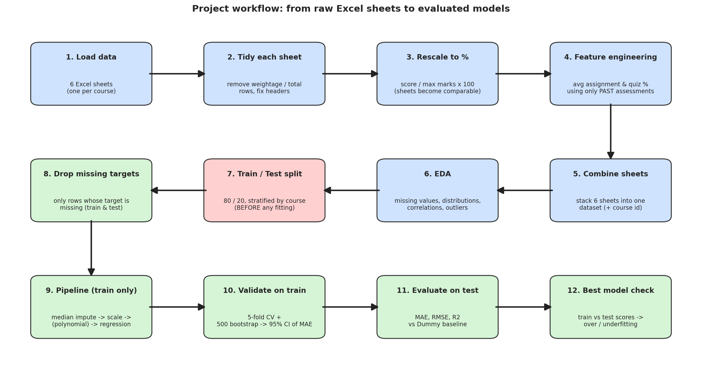

# Student Marks Prediction

Predict a student's **Midterm I**, **Midterm II** and **Final Exam** marks using regression models, and explore the results in an interactive dashboard.

Built for **CS 4048 – Data Science (Fall 2025)**, National University of Computer & Emerging Sciences (FAST), Faisalabad.

---

## What does this project do?

Using marks from assignments, quizzes and earlier exams, it answers three questions:

| Question | What we predict |
|---|---|
| **RQ1** | How accurately can we predict **Midterm I** marks? |
| **RQ2** | How accurately can we predict **Midterm II** marks? |
| **RQ3** | How accurately can we predict **Final Exam** marks? |

Each question only uses information that is **available before the exam** (for example, Midterm II marks are never used to predict Midterm I).

---

## Results (on unseen test students)

Error is measured in **percentage points** of the exam. Lower MAE is better.

| Question | Best model | Error (MAE) | R² | Guessing the average (MAE) |
|---|---|---|---|---|
| RQ1 – Midterm I | Simple regression (early quiz average) | 13.3 | 0.27 | 15.8 |
| RQ2 – Midterm II | Multiple regression | 12.1 | 0.47 | 17.2 |
| RQ3 – Final Exam | Simple regression (Midterm II marks) | 9.9 | 0.57 | 15.6 |

**In plain words:** the more past results we know, the better the prediction. The Final exam is the easiest to predict (about ±10 points), and Midterm I is the hardest because little is known by then. Every model beats the "just guess the average" baseline.

---

## What is inside

```
├── Student_Marks_Prediction.ipynb   # Main notebook: EDA, preprocessing, models, results
├── app.py                           # Interactive Streamlit dashboard
├── marks_dataset.xlsx               # Raw data (6 sheets, one per course)
├── preprocessed_dataset.csv         # Cleaned and combined data used for modelling
├── results_summary.csv              # Comparison table of all models
├── workflow_pipeline.png            # Diagram of the full workflow
└── requirements.txt                 # Python libraries needed
```

---

## How it works

1. **Load** the 6 Excel sheets.
2. **Clean** each sheet and convert every score to a percentage so courses are comparable.
3. **Combine** all sheets into one dataset.
4. **Explore** the data (missing values, distributions, correlations, outliers).
5. **Split** into 80% train and 20% test.
6. **Train** four models for each question: Dummy baseline, Simple, Multiple and Polynomial regression.
7. **Validate** with 5-fold cross-validation and 500 bootstrap samples (95% confidence interval of MAE).
8. **Evaluate** on the test set with MAE, RMSE and R², and compare train vs test to check over/underfitting.



### No data leakage
- The data is split **before** anything is learned from it.
- Filling missing values and scaling are done **only on training data** (inside a scikit-learn Pipeline).
- The best model is chosen with cross-validation on training data, not by peeking at the test set.
- Bootstrapping uses training data only.

---

## How to run

**1. Install Python 3.9 or newer, then clone the repo and install the libraries**
```bash
git clone https://github.com/<your-username>/student-marks-prediction.git
cd student-marks-prediction
pip install -r requirements.txt
```

**2. Open the notebook**
```bash
jupyter notebook
```
Open `Student_Marks_Prediction.ipynb` and click **Kernel → Restart & Run All**.

**3. Launch the dashboard**
```bash
streamlit run app.py
```
It opens at `http://localhost:8501`.

The dashboard has four pages: **Overview & workflow**, **EDA**, **Model results**, and **Try a prediction** (enter a student's marks and get a predicted score).

---

## Assumptions and limitations

- The dataset has no dates, so we assume that **50%** of assignments and quizzes come before Midterm I, **75%** before Midterm II, and **100%** before the Final.
- The dataset is small (254 students), so results can shift slightly with a different split.
- Courses differ in difficulty, which adds variation the models cannot explain.
- The project (`Proj`) column exists in only one course, so it is not used.

---

## Built with

Python · pandas · NumPy · scikit-learn · Matplotlib · Seaborn · Streamlit · Jupyter

---

## Author

**Your Name** – CS 4048 Data Science, FAST-NUCES Faisalabad
[GitHub](https://github.com/your-username) · [LinkedIn](https://linkedin.com/in/your-profile)

*This project was created for educational purposes.*
